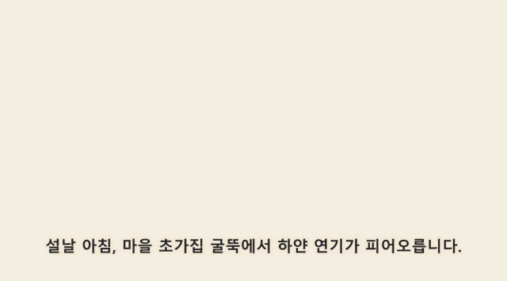

# SRT 화이트보드 애니메이션 Skill v2 (한국어 버전)

SRT 자막을 서사 순서대로 그려지는 화이트보드 손그림 영상으로 변환하는 Claude Code 스킬입니다. **영역별 마스크 연출**과 **스트림 필적 드로잉**을 결합했습니다: 각 요소가 자막을 따라 순서대로 등장하고, 펜촉이 영역 안에서 연속적으로 잉크를 얹은 뒤 단계적으로 채색하며, 최종적으로 MP4로 내보냅니다.

지식 해설, 스토리 내레이션, 강의 자막, 숏폼 대본을 따뜻한 미색 종이 배경의 손그림 애니메이션으로 만들기에 적합합니다.

> **출처:** 이 저장소는 [geeklee/srt-whiteboard-animation](https://github.com/geeklee/srt-whiteboard-animation) (MIT License)을 한국어로 현지화한 [srt-whiteboard-animation-ko](https://github.com/mintorain/srt-whiteboard-animation-ko)의 **v2 업그레이드 버전**입니다. 스킬 지침(SKILL.md), 미리보기 편집대 UI, 스크립트 메시지, 문서를 한국어로 번역했으며, 원본의 저작권은 원작자에게 있습니다.

**설치 방법은 [INSTALL.md](INSTALL.md)를 참고하세요.**

## v2에서 달라진 점

- **자막 번인 내장** — `scripts/burn_subtitles.py`: 렌더링된 MP4에 SRT 자막을 화면에 새겨 넣음 (시스템 ffmpeg 필요, 폰트·크기·여백 옵션)
- **GIF 변환 내장** — `scripts/mp4_to_gif.py`: README·미리보기용 경량 GIF 생성
- **펜대 문구 커스터마이징** — `scripts/set_pen_text.py` + 빈 펜 에셋(`assets/drawing-hand-blank.png`): 원하는 한글 문구를 배럴 각도에 맞춰 자동 합성
- **HyperFrames 파이프라인 (Phase A~C 구현)** — [docs/HYPERFRAMES.md](docs/HYPERFRAMES.md): SVG 장면 생성(`generate_svg_example.py`) → 컴포지션 컴파일(`compile_hyperframes.py`) → HyperFrames 렌더 어댑터(`render_hyperframes.py`, Node 22+ 필요·미설치 시 Python 렌더러 폴백). 브라우저 PoC 포함
- **스켈레톤 필기 품질 개선** — 획 순서를 최근접 이웃 + 근접 획 병합으로 교체: 예시 장면 기준 펜 점프 거리 79% 감소(35,296→7,325px), 펜 들기 188→108회
- **렌더 속도 최적화** — 잉크 리빌을 ROI 연산으로 교체해 스켈레톤 렌더 28.4s→14s(2배). `--preview` 프리셋(640px/30fps) 추가: 초안 4초 렌더
- **TTS 내레이션 합성** — `scripts/add_narration.py`: 자막(SRT)을 한국어 신경망 음성(edge-tts, 무료)으로 읽어 자막 타임코드에 맞춰 영상에 먹싱. 영상은 재인코딩 없음, `--fit`으로 구간 초과 클립 자동 속도 맞춤 (완성 영상은 기본 무음이므로 소리가 필요할 때 사용)
- **미리보기 편집대 실사용 검증** — 헤드리스 브라우저에서 로드·영역 편집·순서 변경·타임라인 스크럽·미저장 이탈 경고까지 확인 (원본 파일 쓰기 저장은 브라우저 보안상 수동 확인 필요)

## 효과 예시

**장면: 설날 아침** — 자막의 서사 순서에 따라 초가집과 굴뚝 연기, 소나무에 앉은 까치, 방패연을 날리는 한복 입은 아이, 떠오르는 붉은 해를 차례로 그립니다.



원본 선화: [PNG 보기](examples/scene-01-seollal.png) · 자막: [SRT 보기](examples/seollal.srt) · 주석: [annotation.json 보기](examples/scene-01-seollal.annotation.json)

> 원본 저장소의 예시(원숭이 산 바나나 뺏기)는 [geeklee/srt-whiteboard-animation](https://github.com/geeklee/srt-whiteboard-animation)에서 볼 수 있습니다.

## 핵심 기능

- SRT 자막을 파싱하고 권장 25–35초 길이로 장면 분할
- 분장(스토리보드)과 삽화 전략을 먼저 제시해 각 장면이 하나의 핵심 의미만 표현하도록 보장
- 화면 좌표가 아닌 자막 이벤트 기준으로 요소의 의미 기반 그리기 순서 구성
- `annotation.json`으로 영역, 타이밍, 자막 연동, 겹침 보호 영역 관리
- 각 영역은 연속 스트림 필적 사용: 먼저 `ink`로 선화를 깔고, `color`로 채색
- 브라우저 미리보기 편집대에서 영역·순서·시간·자막 연동 조정 지원
- 장면별 렌더링과 다중 장면 병합으로 완전한 MP4 출력

## 작동 방식

이 스킬의 핵심은 "자막 주도, 단계별 확인"입니다. 각 단계 완료 후 확인을 기다려, 분장·선화·주석이 확정되기 전에 렌더링 비용을 낭비하지 않습니다:

1. SRT를 파싱하고 분장과 삽화 전략을 제시합니다.
2. 확인 후 통일된 스타일의 선화를 생성합니다.
3. 선화 확인 후, 자막과 원본 이미지를 결합해 주석을 만들고 미리보기 편집대에 로드합니다.
4. 주석 확인 후, 영역 분할과 방향 검사 이미지를 생성합니다.
5. 미리보기 편집대에서 영역, 서사 순서, 타이밍, 자막 연동을 조정하고 저장합니다.
6. 최종 주석 확인 후, 장면별로 MP4를 렌더링합니다.
7. 다중 장면 프로젝트는 각 장면 완성본 확인 후 병합합니다.

## 시각 규범

- 따뜻한 미색 종이 배경: 권장 `#F5EBD7`
- 짙은 회색 스케치 선, 빨강·주황·파랑은 소량의 개념적 포인트로만 사용
- 미니멀 손그림, 깨끗한 배경과 충분한 여백
- 장면 내 문자, 라벨, 사진 느낌, 3D 효과, 복잡한 텍스처 사용 금지

## 설치와 환경

스킬은 독립적인 Python 가상환경 준비 스크립트를 내장합니다. 최초 실행 시:

```bash
python scripts/prepare_env.py --check
python scripts/prepare_env.py
```

성공하면 첫 번째 명령이 `ENV_PY=<경로>`를 출력합니다. 이후 렌더링에는 이 인터프리터를 사용해 의존성 격리를 유지하세요.

## 프로젝트 소재 구조

```text
assets/whiteboard/<프로젝트명>/
├── scene-01-<이름>.png
├── scene-01-<이름>.annotation.json
├── scene-01-<이름>-whiteboard.mp4
└── scene-01-<이름>-preview.mp4
```

이미지와 주석은 같은 이름이어야 합니다. 예: `scene-01-demo.png` ↔ `scene-01-demo.annotation.json`.

## 주석 형식

각 요소는 원본 이미지의 정수 픽셀 좌표를 사용하며, `sequence`, `subtitle`, `narrativeRole`을 통해 자막 속 이벤트와 연결됩니다. 영역은 "장면 깔기 → 핵심 인물/사물 → 행동 또는 변화 → 반응/결과" 순으로 정렬해야 합니다.

```json
{
  "sceneId": "scene-01",
  "canvas": { "width": 1672, "height": 941 },
  "storyBasis": "새끼 원숭이가 원숭이 산에서 바나나를 들고 있고, 큰 원숭이가 바나나를 뺏고, 아이들이 옆에서 구경한다.",
  "sceneDurationMs": 9000,
  "elements": [
    {
      "id": "rockery",
      "label": "원숭이 산 장면",
      "sequence": 1,
      "narrativeRole": "이야기의 장면 깔기",
      "subtitle": "새끼 원숭이가 원숭이 산 꼭대기에 앉아 바나나를 들고 있다.",
      "type": "structure",
      "region": { "x": 20, "y": 120, "width": 540, "height": 780 },
      "reveal": {
        "direction": "top_to_bottom",
        "startMs": 300,
        "durationMs": 2600,
        "maskPaddingPx": 22,
        "protectedRegions": []
      },
      "handPath": { "start": [290, 130], "end": [290, 890], "easing": "easeInOut" }
    }
  ]
}
```

`direction`과 `handPath`는 미리보기 편집대의 사각형 프록시 용도입니다. 최종 완성본의 실제 필적은 스트림 렌더러가 자동 생성합니다. 서로 가리는 오브젝트는 앞 요소의 `protectedRegions`에 늦게 표시할 영역을 지정해, 이후 내용이 미리 드러나지 않게 합니다.

## 자주 쓰는 명령

자막 파싱과 권장 분장 생성:

```bash
python scripts/parse_srt.py <자막.srt> --target-sec 30 --min-sec 25 --max-sec 35
```

영역 검사 이미지 생성:

```bash
python scripts/render_annotation_preview.py <이미지_경로> <주석_경로> <미리보기_출력_경로>
```

`assets/preview.html`을 열고 "폴더 열기"로 장면 디렉터리를 로드하면 영역·순서·시간·자막 연동을 편집할 수 있습니다.

단일 장면 렌더링:

```bash
<ENV_PY> scripts/render_stream_whiteboard.py <이미지_경로> <주석_경로> <출력.mp4> assets/drawing-hand.png \
  --ink-path grid --color-fill contour-wipe
```

다중 장면 병합:

```bash
<ENV_PY> scripts/merge_scenes.py --inputs 장면1.mp4 장면2.mp4 장면3.mp4 --output final.mp4
```

## 품질 검사

- 첫 프레임이 깨끗한 미색 종이 바탕이며, 미리 드러난 선이 없음
- `canvas`가 원본 이미지 크기와 일치하고, 모든 영역이 캔버스 안의 정수 픽셀 좌표
- `sequence`, `startMs`가 자막의 서사 순서와 일치
- 중간 프레임에서 시작 전 영역과 보호 영역이 미리 나타나지 않음
- 펜촉이 현재 스트림 필적에 밀착. 선화가 뚜렷하면 `--ink-path skeleton` 선택 가능
- 각 장면 종료 후 최소 0.5초 동안 완전한 화면 유지. 다중 장면 병합 순서가 자막 분장과 일치

## 저장소 내용

```text
srt-whiteboard-animation/
├── SKILL.md                         # 전체 워크플로와 제약
├── assets/
│   ├── drawing-hand.png              # 손 이미지 소재
│   ├── preview.html                  # 로컬 편집 미리보기 편집대
├── examples/                         # README 예시 소재
├── scripts/
│   ├── parse_srt.py                  # 자막 파싱과 분장 제안
│   ├── render_annotation_preview.py  # 주석 검사 이미지
│   ├── render_stream_whiteboard.py   # 스트림 필적 MP4 렌더러
│   ├── merge_scenes.py               # 다중 장면 병합
│   ├── prepare_env.py                # 의존성 환경 준비
│   ├── burn_subtitles.py             # 자막 번인 (v2)
│   ├── mp4_to_gif.py                 # GIF 변환 (v2)
│   └── set_pen_text.py               # 펜대 문구 교체 (v2)
├── docs/HYPERFRAMES.md               # HyperFrames 적용 검토 (v2)
├── experimental/hyperframes-poc.html # SVG 필기 PoC (v2)
├── agents/openai.yaml                # Codex 메타데이터
├── INSTALL.md                        # 설치 안내 (한국어)
├── install.ps1                       # Windows 자동 설치 스크립트
└── install.sh                        # macOS / Linux 자동 설치 스크립트
```

## 기여

Issue와 Pull Request를 환영합니다. 드로잉 로직과 관련된 변경은 실제 자막·주석·완성본으로 마스크 보호, 타이밍, 최종 화면을 검사해야 합니다.

## 라이선스

이 프로젝트는 MIT License로 공개되어 있습니다. [LICENSE](LICENSE)를 참고하세요.

## 원작자

물고기 기르기를 좋아하는 아저씨 / AI Builder / AI 팀으로 1인 회사를 만드는 중.

더우인·빌리빌리·위챗 공식계정: 江哥是老登啊 (원작자)
